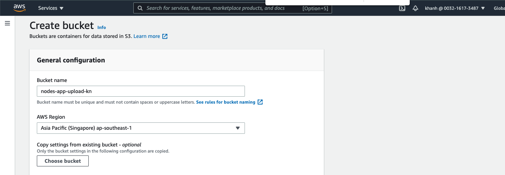
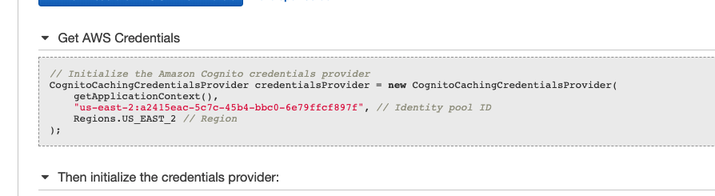

 # Report 

Repo: https://github.com/24hdev-khanhnoi/serverless
<br>

#### Finish:
- Setting up a Serverless app ( setup, deoloy helloworld,..)
- Create your AWS resources (DynamoDB Table,  S3 Bucket for File Uploads)
- Building a Serverless API (setup base, CRUD simple, deplpy,..)
- Users and authentication (Cognito user pool, Cognito identity pool,...)
<br>

#### Problem:
- You have attempted to create more buckets than allowed
For information about how to increase your bucket limit (Fix Done)
- Eslint ( Fix Done)
<br>

##### images


 
 # Serverless Node.js Leaning 

 # Report

- 21/7
 #### Tìm hiểu serverless, AWS Lambda, IAM, ..
 #### IAM
 
  
  
 #### Configure the AWS CLI , Install the AWS CLI
 ```
 brew install awscli
 aws configure
 ```
 
  


 #### Setting up a Serverless app

 ```
 npm install -g serverless
 serverless install --url https://github.com/AnomalyInnovations/serverless-nodejs-starter --name notes-api
 ```


##### handler.js: Là nơi mà chúng ta sẽ định nghĩa các hàm lambda (Lambda Function).

#####  serverless.yml: Là nơi chúng ta sẽ khai báo cấu hình cho ứng dụng, file này thông thường có 3 phần chính sau:
Provider: Sử dụng để công khai các cấu hình cụ thể cho nhà cung cấp dịch vụ Cloud, ví dụ như cấu hình tên nhà cung cấp, môi trường runtime, khu vực sử dụng…vv

Functions: Chúng ta sẽ chỉ định các Function logic chức năng tại đây.

Resources: Phần này sẽ khai báo các tài nguyên để cho các Functions của bạn sử dụng được. Tài nguyên sẽ được khai báo bởi một dịch vụ của AWS có tên là CloudFormation.

```
npm install aws-sdk --save-dev
npm install uuid@7.0.3 --save
```
   
      

##### aws-sdk allows us to talk to the various AWS services.
##### auuid generates unique ids. We need this for storing things to DynamoDB..
#### Add support for ES6 and TypeScript
```
npm install --save-dev serverless-bundle
```


#### Deploy your Hello World API

```
serverless deploy
```


#### Initialize the Backend Repo 

Repo: https://github.com/24hdev-khanhnoi/serverless 


#### Create a DynamoDB Table


#### Create a DynamoDB Table


###### Nếu có Lỗi


- 22/7
 Fix bằng cách xoá 1 vài bucket không quan trọng
 

Sau khi thêm: 
 
  

#### Building a Serverless API


##### Add a Create Note API
``` create.js ``` ( test )

   
``` serverless.yml ```

   
``` mocks/create-event.json ```

   

``` 
$ serverless invoke local --function create --path mocks/create-event.json
```
   

##### Refactor Our Code

```
/create.js
/libs/dynamodb-lib.js
libs/handler-lib.js
```


##### Problem
Nếu có lỗi:
 
   

Fix bằng cách formatcode ở các file đó

#### CRUD config serverless.yml

#### Add a Get Note API


#### Add a list all the notes API


#### Add an update note API


#### Deploy the APIs


```
POST - https://jcentwq22d.execute-api.us-east-1.amazonaws.com/prod/notes
  GET - https://jcentwq22d.execute-api.us-east-1.amazonaws.com/prod/notes/{id}
  GET - https://jcentwq22d.execute-api.us-east-1.amazonaws.com/prod/notes
  PUT - https://jcentwq22d.execute-api.us-east-1.amazonaws.com/prod/notes/{id}
  DELETE - https://jcentwq22d.execute-api.us-east-1.amazonaws.com/prod/notes/{id}
  GET - https://jcentwq22d.execute-api.us-east-1.amazonaws.com/prod/hello
```

#### Handling Auth in Serverless APIs


#### Create a Cognito User Pool

##### Create User Pool


##### Create App Client


##### Create Domain Name


#### Create a Cognito Test User


##### Create User


Sử dụng AWS CLI để đăng ký người dùng bằng email và mật khẩu của họ.

```
aws cognito-idp sign-up \
  --region YOUR_COGNITO_REGION \
  --client-id YOUR_COGNITO_APP_CLIENT_ID \
  --username admin@example.com \
  --password Passw0rd!
```

```
aws cognito-idp sign-up \
  --region us-east-2 \
  --client-id 59j0tt0qci8dm9us7an226srsb \
  --username nqkhanh1998@gmail.com \
  --password Passw0rd!
```

Người dùng được tạo trong Cognito User Pool. Tuy nhiên, trước khi người dùng có thể xác thực với User Pool, tài khoản cần được xác minh. Hãy nhanh chóng xác minh người dùng bằng lệnh quản trị viên.


```
aws cognito-idp admin-confirm-sign-up \
  --region YOUR_COGNITO_REGION \
  --user-pool-id YOUR_COGNITO_USER_POOL_ID \
  --username admin@example.com
```

```
aws cognito-idp admin-confirm-sign-up \
  --region us-east-2 \
  --user-pool-id us-east-2_c7ZXkYHe7 \
  --username nqkhanh1998@gmail.com
```

#### Create a Cognito Identity Pool

##### Create Pool


- 23/7


```
YOUR_S3_UPLOADS_BUCKET_NAME  notes-app-uploads-kn
YOUR_API_GATEWAY_ID jcentwq22d
YOUR_API_GATEWAY_REGION us-east-2

````

```
{
  "Version": "2012-10-17",
  "Statement": [
    {
      "Effect": "Allow",
      "Action": [
        "mobileanalytics:PutEvents",
        "cognito-sync:*",
        "cognito-identity:*"
      ],
      "Resource": [
        "*"
      ]
    },
    {
      "Effect": "Allow",
      "Action": [
        "s3:*"
      ],
      "Resource": [
        "arn:aws:s3:::notes-app-upload-kn/private/${cognito-identity.amazonaws.com:sub}/*"
      ]
    },
    {
      "Effect": "Allow",
      "Action": [
        "execute-api:Invoke"
      ],
      "Resource": [
        "arn:aws:execute-api:us-east-1:*:jcentwq22d/*/*/*"
      ]
    }
  ]
}

```


#### Secure the APIs

##### Serverless IAM Auth


#### Test the APIs


##### Problem

Lỗi 403 


Có vẻ như mình đã config khi create identity pool
Fix bằng cách xoá identity pool cũ và lập cái mới
Thì sẽ có lỗi là role cũ đã tồn tại. 3 cách
1. đặt tên role mới ( VD thêm số 2 sau)
2. Vô config role lại
3. xoá role cũ đi

Mình đã xoá role cũ đi 





```
npx aws-api-gateway-cli-test \
--username='admin@example.com' \
--password='Passw0rd!' \
--user-pool-id='YOUR_COGNITO_USER_POOL_ID' \
--app-client-id='YOUR_COGNITO_APP_CLIENT_ID' \
--cognito-region='YOUR_COGNITO_REGION' \
--identity-pool-id='YOUR_IDENTITY_POOL_ID' \
--invoke-url='YOUR_API_GATEWAY_URL' \
--api-gateway-region='YOUR_API_GATEWAY_REGION' \
--path-template='/notes' \
--method='POST' \
--body='{"content":"hello world","attachment":"hello.jpg"}'


```
npx aws-api-gateway-cli-test \
--username='nqkhanh1998@gmail.com' \
--password='Passw0rd!' \
--user-pool-id='us-east-2_c7ZXkYHe7' \
--app-client-id='59j0tt0qci8dm9us7an226srsb' \
--cognito-region='us-east-2' \
--identity-pool-id='us-east-2:a2415eac-5c7c-45b4-bbc0-6e79ffcf897f' \
--invoke-url='https://jcentwq22d.execute-api.us-east-1.amazonaws.com/prod' \
--api-gateway-region='us-east-1' \
--path-template='/notes' \
--method='POST' \
--body='{"content":"hello world cli test","attachment":"helloCLITest.jpg"}'

```


```
npx aws-api-gateway-cli-test --username nqkhanh1998@gmail.com --password Passw0rd! --user-pool-id us-east-2_c7ZXkYHe7 --app-client-id 59j0tt0qci8dm9us7an226srsb --cognito-region us-east-2 --identity-pool-id us-east-2:a2415eac-5c7c-45b4-bbc0-6e79ffcf897f --invoke-url https://jcentwq22d.execute-api.us-east-1.amazonaws.com/prod --api-gateway-region us-east-1 --path-template /notes --method POST --body "{\"content\":\"hello world2\",\"attachment\":\"hello2.jpg\"}"

```


<hr>


# Problem
- 21/7 
You have attempted to create more buckets than allowed
For information about how to increase your bucket limit

Fix bằng cách xoá 1 vài bucket không quan trọng
 

- 22/7
   

Fix bằng cách formatcode ở các file đó

23/7 

 Lỗi 403 


Có vẻ như mình đã config khi create identity pool
Fix bằng cách xoá identity pool cũ và lập cái mới
Thì sẽ có lỗi là role cũ đã tồn tại. 3 cách
1. đặt tên role mới ( VD thêm số 2 sau)
2. Vô config role lại
3. xoá role cũ đi

Mình đã xoá role cũ đi 


<hr>