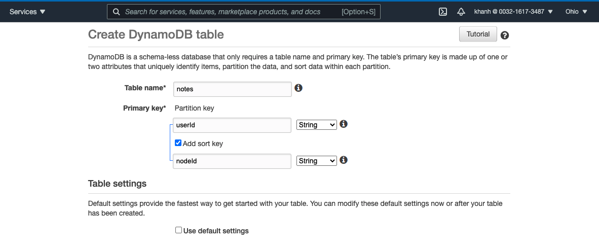

 # Serverless Node.js Leaning 

 # Report

- 21/7
 #### Tìm hiểu serverless, AWS Lambda, IAM, ..
 #### IAM
 
  
  
 #### Configure the AWS CLI , Install the AWS CLI
 ```
 brew install awscli
 aws configure
 ```
 
  


 #### Setting up a Serverless app

 ```
 npm install -g serverless
 serverless install --url https://github.com/AnomalyInnovations/serverless-nodejs-starter --name notes-api
 ```


##### handler.js: Là nơi mà chúng ta sẽ định nghĩa các hàm lambda (Lambda Function).

#####  serverless.yml: Là nơi chúng ta sẽ khai báo cấu hình cho ứng dụng, file này thông thường có 3 phần chính sau:
Provider: Sử dụng để công khai các cấu hình cụ thể cho nhà cung cấp dịch vụ Cloud, ví dụ như cấu hình tên nhà cung cấp, môi trường runtime, khu vực sử dụng…vv

Functions: Chúng ta sẽ chỉ định các Function logic chức năng tại đây.

Resources: Phần này sẽ khai báo các tài nguyên để cho các Functions của bạn sử dụng được. Tài nguyên sẽ được khai báo bởi một dịch vụ của AWS có tên là CloudFormation.

```
npm install aws-sdk --save-dev
npm install uuid@7.0.3 --save
```
   
      

##### aws-sdk allows us to talk to the various AWS services.
##### auuid generates unique ids. We need this for storing things to DynamoDB..
#### Add support for ES6 and TypeScript
```
npm install --save-dev serverless-bundle
```


#### Deploy your Hello World API

```
serverless deploy
```


#### Initialize the Backend Repo 
Repo: https://github.com/24hdev-khanhnoi/serverless 


#### Create a DynamoDB Table



#### Create a DynamoDB Table


###### Đang có Lỗi

# Problem
- 21/7 
You have attempted to create more buckets than allowed
For information about how to increase your bucket limit


<hr>


Repo: https://github.com/24hdev-khanhnoi/serverless
Finish:
- Setting up a Serverless app ( setup, deoloy helloworld,..)
- Create your AWS resources (DynamoDB Table,  S3 Bucket for File Uploads)
Problem:
You have attempted to create more buckets than allowed
For information about how to increase your bucket limit


